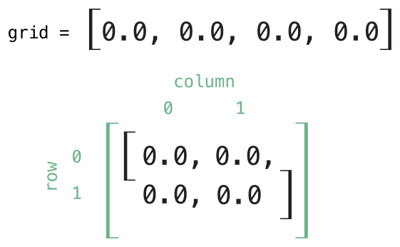

# Indexek
---------
Osztályok, struktúrák és enumerációs is definiálhatnak *indexeket (subscripts)*, amelyek egyszerű hozzáférést biztosítanak egy kollekció, lista vagy szekvencia elemeihez. Az indexek segítségével úgy tudjuk kiolvasni és beállítani ezeket az értékeket, hogy nincs szükség külön metódusokra a beállításhoz és kinyeréshez. Például egy `Array` példány elemeit a `someArray[index]` szintaxison keresztül, míg egy `Dictionary` példány elemeit a `someDictionary[key]` szintaxison keresztül érhetjük el.

Egy adott típushoz többféle index is definiálható és a megfelelő index az alapján lesz kiválasztva, hogy milyen típusú értéket használunk paraméterként. Az indexek nem korlátozódnak csupán egy dimenzióra és arra is lehetőség van, hogy annyi bemenő paramétert használjunk, amennyi a legjobban szolgálja az adott típus érdekeit.

‌<a name="subscript_syntax"></a>
## Index szintaxis

Az indexek segítségével egy adott típus pédányait tudjuk lekérdezni, ha a példány neve után szögletes zárójelek között megadjuk az index egy vagy több paraméterét A szintaxis nagyon hasonlatos a példánymetódusok és számolt tulajdonságok szintaxisához. Az index definiálásához a `subscript` kulcsszó használata szükséges, majd fel kell sorolnuk a bemeneti paramétereket és a visszaadott típust, ugyanúgy mint a példánymetódusok esetén. Viszont a példánymetódusokkal ellentétben, az indexek olvashatóak és írhatóak is lehetnek. Ezt a tulajdonságokhoz hasonlóan getter és setter segítségével tudjuk elérnix:

```swift
subscript(index: Int) -> Int {
    get {
        // a megfelelő index érték visszadása
    }
    set(newValue) {
        // beállítások elvégzése
    }
}
```

A `newValue` típusa megegyezik az index visszaadott típusával. Mint ahogyan a számított tulajdonságok esetén, itt sem szükséges külön specifikálni a setter `(newValue)` paraméterét. Ilyen esetben egy alapértelmezett `newValue` paramétert kap a setter.

A csak olvasható kalkulált paraméterekhez hasonlóan, a `get` kulcsszó elhagyható a csak olvasható indexek esetén:

```swift
subscript(index: Int) -> Int {
    // a megfelelő index érték visszadása
}
```

Itt egy példa egy csak olvasható index implementációjára, amiben egy `TimesTable` struktúrát definiálunk ami az `n` egész számhoz tartozó szorzótáblát hivatott reprezentálni:

```swift
struct TimesTable {
    let multiplier: Int
    subscript(index: Int) -> Int {
        return multiplier * index
    }
}
let threeTimesTable = TimesTable(multiplier: 3)
print("hatszor három egyenlő \(threeTimesTable[6])")
// Eredmény: "hatszor három egyenlő 18"
```

A példában a létrehozott `TimesTable` példány a három szorzótábláját reprezentálja. A `3` átadásával jeleztük a struktúra *inicializálója* számára, hogy a példány ezt használja a `multiplier` paraméter értékeként.

A `threeTimesTabl`e értékei lekérdezhetőek az index segítségével, mint ahogy a fenti példában is láthatjuk: `threeTimesTable[6]`. Ez a hatodik értéket kéri le a hármas szorzótáblából, aminek értéke `18`, azaz `3 * 6`.

> MEGJEGYZÉS  
Egy n-hez tartozó szorzótábla fix matematikai szabályon nyugszik. Ezért nem értelmezhető a `threeTimesTable[someIndex]` új értékének beállíthatósága, így az index a `TimesTable` struktúrához csak olvasható indexként van definiálva.

‌<a name="subscript_usage"></a>
## Index használata

Az "index" pontos jelentése nagyban függ a használat kontextusától. Az indexeket általában egy kollekció, lista vagy szekvencia elemeinek egyszerű eléréséhez szokták használni. De akármilyen implementáció készíthető, attól függően, hogy mi szolgálja legjobban egy adott osztály vagy struktúra érdekeit.

Például a Swift `Dictionary` típusa egyolyan indexeket implementál, amivel egy `Dictionary` példány elemeit tudjuk olvasni és írni. Úgy tudunk egy értéket megadni a dictionary számára, ha a megadott típus szerinti kulcsot kapcsos zárójelbe rakunk és megadjuk az adott indexhez tárolni kívánt értéket:

```swift
var numberOfLegs = ["spider": 8, "ant": 6, "cat": 4]
numberOfLegs["bird"] = 2
```

A fenti példában definiálunk egy `numberOfLegs` nevű változót és egy dictionary literal segítségével inicializáljuk, ami három kulcs-érték párost tartalmaz. A `numberOfLegs` dictionary pontos típusa `[String: Int]` lesz. Miután a dictionary létre lett hozva, a következő sorban a `"bird"` `String` típusú kulcssal az `Int` típusú `2` számot adjuk hozzá a dictionary-höz.

További információt a Dictionary indexelésével kapcsolatban itt találhatsz: [Dictionary hozzáférése és módosítása](markdown/CollectionTypes.md).

> MEGJEGYZÉS  
A Swift `Dictionary` típusának kulcs-érték indexelését úgy valósították meg, hogy az index egy *opcionális* típust fogad és tér vissza vele. A fenti `numberOfLegs` dictionary, kulcs-érték értéke `Int?` típust fogad és ad vissza, azaz “opcionális int”. A `Dictionary` típus ezt az opcionális megközelítést használja azon egyszerű ok miatt, hogy nem minden kulcshoz tartozik érték illetve egy adott kulcshoz rendlt értéke egyszerűen törölhető a `nil` értékül adásával.

‌<a name="subscript_options"></a>
## Index opciók

Az indexek akárhány input paraméterrel rendelkezhetnek és ezek típusa is bármilyen lehet. Tovább a visszaadott típus is bármi lehet. Az indexek használhatnak fix és változó számú paramétereket is, de nem lehet in-out paramétereket vagy alapértelmezett paraméter értékeket használni.

Egy osztály vagy struktúra tetszőleges számú indexet tartalmazhat, a megfelelő index a használt érték típusa alapján vagy a szögletes zárójelben megadott paraméter(ek) típusa alapján kerül majd kiválasztásra. Több index egyidejű definicióját szokás *index túlterhelésnek (subscript overloading)* is nevezni.

A legtöbb esetben csupán egy paramétert szoktunk használni az indexek esetén, de ha szükségét érezzük, semmi akadálya több paraméter használatának. A következő példában a `Matrix` struktúrát hozzuk létre ami egy kétdimenziós `Double` típusú mátrixot reprezentál. A `Matrix` struktúra indexe két integer paramétert vár tőlünk:

```swift
struct Matrix {
    let rows: Int, columns: Int
    var grid: [Double]
    init(rows: Int, columns: Int) {
        self.rows = rows
        self.columns = columns
        grid = Array(count: rows * columns, repeatedValue: 0.0)
    }
    func indexIsValidForRow(row: Int, column: Int) -> Bool {
        return row >= 0 && row < rows && column >= 0 && column < columns
    }
    subscript(row: Int, column: Int) -> Double {
        get {
            assert(indexIsValidForRow(row, column: column), "Index out of range")
            return grid[(row * columns) + column]
        }
        set {
            assert(indexIsValidForRow(row, column: column), "Index out of range")
            grid[(row * columns) + column] = newValue
        }
    }
}
```

A `Matrix` inicializálója két paramétert fogad: `rows` és `columns`, majd létrehoz egy tömböt, ami elég nagy `rows * columns` számú `Doubl`e típusú érték tárolására. A mátrix minden értéke alapértékként `0.0` lesz. Ehhez a tömb méretét és a `0.0` alapértéket átadjuk a tömb inicializálójának. Az inicializálóról bővebben itt olvashatsz Egy tömb létrehozásak alapértékkel.

Létre tudsz hozni egy új `Matrix` példányt a sorok és oszlopok számának megadásával az inicializáló számára:

```swift
var matrix = Matrix(rows: 2, columns: 2)
```

Az előző példában létrehozott `Matrix` példány két sort és két oszlopot tartalmaz. A `Matrix` példány `grid` tömbje a mátrix kilapított, egy dimenziós változatát reprezentálja, bal felülről jobb alulra haladva:



A mátrix egy elemének az értékét, a szögletes zárójelek közé rakott, vesszővel elválasztott sor és oszlop értékek megadásával lehet megváltoztatni:

```swift
matrix[0, 1] = 1.5
matrix[1, 0] = 3.2
```

Az első utasítás az index setter-ét hívja meg, hogy a mátrix jobb felső pozíciójában az új érték `1.5` legyen (ahol a `row` értéke 0 és a `column` értéke 1), míg `3.2` legyen a bal alsó pozícióban (ahol a `row` értéke 1 és a `column` értéke 0):


 
A getter és setter is tartalmaz egy ellenőrzést, hogy a megadott `row` és `column` értékek megfelelőek-e. Ezt az ellenőrzést elősegítendő, a `Matrix` rendelkezik egy `indexIsValidForRow(_:column:)` metódussal, ami megvizsgálja, hogy az átadott `row` és `column` paraméterek megfelelnek-e a mátrix dimenzióinak:

```swift
func indexIsValidForRow(row: Int, column: Int) -> Bool {
    return row >= 0 && row < rows && column >= 0 && column < columns
}
```

Hibához fog vezetni, ha olyan indexet használunk ami a mátrix határain kívól esik:

```swift
let someValue = matrix[2, 2]
// hibás, mivel a [2, 2] a mátrix határain kívülre esik
```
